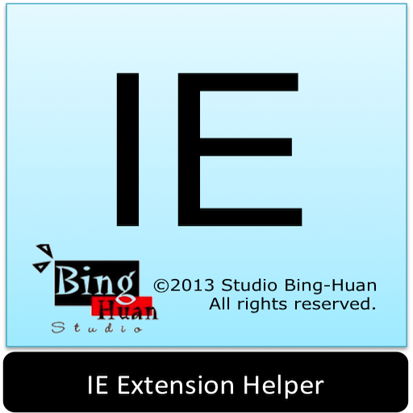

IeExtensionHelper
=================
 

    link: <a href="http://studiobinghuan.blogspot.tw/2013/11/ie-extension-helper.html">http://studiobinghuan.blogspot.tw/2013/11/ie-extension-helper.html</a>

	My Blog: <a href="http://studiobinghuan.blogspot.tw/?view=flipcard">http://studiobinghuan.blogspot.tw/?view=flipcard</a> 
	or <a href="http://bhtalk.blogspot.tw/">http://bhtalk.blogspot.tw/</a>

